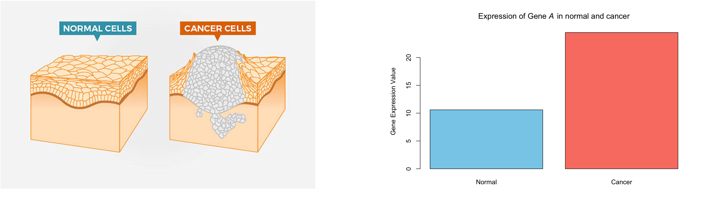

# Overview

This session will give hands-on feel on conducting a bioinformatics workshop. 

In the next 2 hours, we will cover the following secions ;

1. Introduction to Binformatics
2. Introduction to R
3. RNA-sequencing analysis


# The question that we will answer

What are the differentially expressed genes between normal cells and cancer cells?

Cancer is a disease in which some of the body's cells grow uncontrollably and spread to other parts of the body. Cancer is caused by certain changes to genes. 

# Introduction to Cancer Bioinformatics


- What pattern is in one image compared to the other. 
- Image taken from [Michael Edwards lecture](https://www.youtube.com/watch?v=YxTYjzl8uC4)


- Cancer is caused by changes to genes that control the way our cell function.
- There are about 20,000 genes in the human genome.
- Image taken from [National Cancer Institute](https://www.cancer.gov/about-cancer/understanding/what-is-cancer)


# Introduction to R and RStudio 

**What is R**

- R is an open-source language and environment for statistical computing and graphics, widely used by scientists.
- R is both a computational language and environment for statistical computing, data visualization, data science and machine learning
- RStudio is an integrated development environment for R and Python
- Rstudio provides a graphic user interface for working with R
- In this session, we will showcase an cloud based RStudio Server - 
- User can install R and Rstudio locally on their device


**Introduction to RStudio interface**

- Panel towards the top left is the scrip 
- Basic math function 

Addition

```{r}
3 + 3
```


Multiplication

```{r}
3 * 3
```

Storing variables in R

```{r}
num1 <- 5
num2 = 10

num1 + num2
```

A more practical example. Lets create a **vector** storing multiple values

```{r}
#create vectors to hold plant heights from each sample
group1 <- c(8, 8, 9, 9, 9, 11, 12, 13, 13, 14)
group2 <- c(22, 23, 24, 24, 25, 26, 27, 20, 26, 28)
```

Lets get the sum

```{r}
8 + 8 + 9 + 9 + 9 + 11 + 12 + 13 + 13 + 14
```

Now the mean

```{r}
(8 + 8 + 9 + 9 + 9 + 11 + 12 + 13 + 13 + 14) / 10
```


Use in built function in R.

Get the sum

```{r}
sum(group1)
```

Get the mean

```{r}
mean(group1)
```

Get the standard deviation

```{r}
sd(group1)
```

## Visuzalize data

```{r}
# Calculate means
means <- c(mean(group1), mean(group2))

# Make bar plot
barplot(means, names.arg = c("Group 1", "Group 2"),
        col = c("skyblue", "salmon"),
        main = "Average Plant Height",
        ylab = "Mean Height")
```

We can show as box plot as well

```{r}
boxplot(group1, group2,
        names = c("Group 1", "Group 2"),
        col = c("skyblue", "salmon"),
        main = "Boxplot of Plant Heights",
        ylab = "Height")
```

## Statistical test

Perform t-test. The T-test is performed using the `t.test()` function, which essentially tests for the difference in means of a variable between two groups. 

```{r}
t.test(group1, group2)
```
`t.test` saves a lot of information: the difference in means estimate, confidence interval for the difference conf.int, the p-value p.value, etc.


# RNA-sequencing analysis




- The example shows the expression level of **one** gene.
- How can we repeat the analysis for 20,000 genes?
- Where does the gene expression data comes from? **Sequencing**

We can plot individual data as well

```{r}
library(ggplot2)

# Create data frame
df <- data.frame(
  Height = c(group1, group2),
  Group = rep(c("Normal", "Cancer"), times = c(length(group1), length(group2))),
  Plant = paste("Plant", sprintf("%02d", 1:length(group1))))

# Plot
ggplot(df, aes(x = Group, y = Height, fill = Group)) +
  geom_bar(stat = "identity") +
  facet_wrap(~ Plant, scales = "free_x") +
  theme_minimal() +
  theme(axis.text.x = element_text(angle = 45, hjust = 1)) +
  labs(title = "Individual Plant Heights by Group",
       y = "Height",
       x = "Plant") +
  scale_fill_manual(values = c("Group 1" = "skyblue", "Group 2" = "salmon"))
```


## Example data

- 20 patients
  - 10 normal
  - 10 cancer
- About 20,000 genes


## Reading in data

Lets read in actual data from an experiment comparing tumor and normal

Read in counts

```{r}
rawCounts <- 
```
