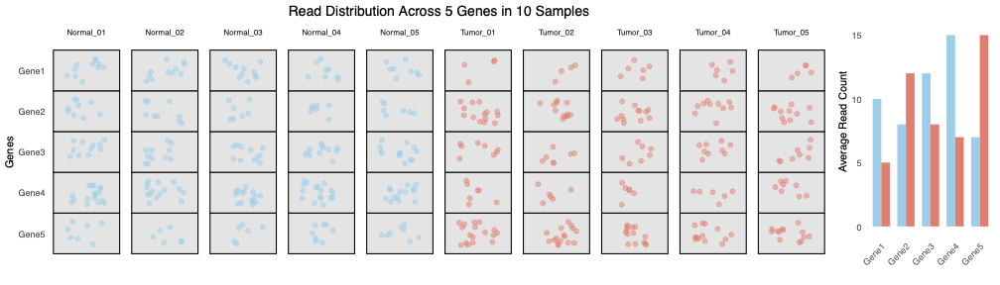

# Overview

This session will give hands-on feel on conducting a bioinformatics analysis 

We will cover the following sections ;

1. **Introduction to Binformatics**
2. **Introduction to R**
3. **RNA-sequencing analysis**


# Section 1: The question that we will answer

Cancer is a disease in which some of the body's cells grow uncontrollably and spread to other parts of the body. Cancer is caused by certain changes to genes.   

What are the **differentially expressed** genes between normal cells and cancer cells?  What do we mean by **differentially expressed**?  

- For each gene, we want to know:
- Which genes are much more active in cancer?  
- Which genes are less active in cancer?  
- Which genes don't really change?  


- Cancer is caused by changes to genes that control the way our cell function.
- There are about 20,000 genes in the human genome.
- Image taken from [National Cancer Institute](https://www.cancer.gov/about-cancer/understanding/what-is-cancer)

<div style="border-left: 4px solid #0072B2; background: #e6f2ff; padding: 0.5em 1em; margin: 1em 0;">
<b>Key Point:</b> We want to be clear what analysis are we conducting.
</div>

---

# Section 2: Introduction to R and RStudio 

**What is R**

- R is an open-source language and environment for statistical computing and graphics, widely used by scientists.
- R is both a computational language and environment for statistical computing, data visualization, data science and machine learning
- RStudio is an integrated development environment for R and Python
- Rstudio provides a graphic user interface for working with R
- In this session, we will showcase an cloud based RStudio Server - 
- User can install R and Rstudio locally on their device


**Introduction to RStudio interface**

- Panel towards the top left is the scrip 
- Basic math function 

Addition
```{r}
3 + 3
```

Multiplication
```{r}
3 * 3
```

Storing variables in R
```{r}
num1 <- 5
num2 = 10

num1 + num2
```

A more practical example. Lets create a **vector** storing multiple values
```{r}
#create vectors to hold plant heights from each sample
group1 <- c(8, 8, 9, 9, 9, 11, 12, 13, 13, 14)
group2 <- c(22, 23, 24, 24, 25, 26, 27, 20, 26, 28)
```

Lets get the sum
```{r}
8 + 8 + 9 + 9 + 9 + 11 + 12 + 13 + 13 + 14
```

Now calculate the average (mean)
```{r}
(8 + 8 + 9 + 9 + 9 + 11 + 12 + 13 + 13 + 14) / 10
```


## Using R functions

<div style="border-left: 4px solid #0072B2; background: #e6f2ff; padding: 0.5em 1em; margin: 1em 0;">
<b>Key Point:</b> R has built in function that we can use to perform mathematical / statistical operations.
</div>

Using the `sum` function to calculate the sum
```{r}
sum(group1)
```

Using the `mean` function to calculate the average (mean)
```{r}
mean(group1)
```

## Visuzalize data

<div style="border-left: 4px solid #0072B2; background: #e6f2ff; padding: 0.5em 1em; margin: 1em 0;">
<b>Key Point:</b> R has built in function to quickly visualize data.
</div>

Given our previous example of `group1` and `group2`, we can display the data as a barplot. 

```{r}
# Calculate means
means <- c(mean(group1), mean(group2))

# Make bar plot
barplot(means, names.arg = c("Group 1", "Group 2"),
        col = c("skyblue", "salmon"),
        main = "Average Plant Height",
        ylab = "Mean Height")
```

Other forms of vizulaisation using R

## Statistical test

<div style="border-left: 4px solid #0072B2; background: #e6f2ff; padding: 0.5em 1em; margin: 1em 0;">
<b>Key Point:</b> R has built in function to perform statistical test.
</div>

A *t-test* is a statistical test that is used to compare the means of two groups. It is often used in hypothesis testing to determine whether two groups are different from one another.

\[
t = \frac{\bar{x}_1 - \bar{x}_2}{\sqrt{\frac{s_1^2}{n_1} + \frac{s_2^2}{n_2}}}
\]

where:  
- \(\bar{x}_1, \bar{x}_2\) are the sample means  
- \(s_1^2, s_2^2\) are the sample variances  
- \(n_1, n_2\) are the sample sizes  


Variance is simply the spread of the data 

```{r, echo=FALSE}
library(ggplot2)
df <- data.frame(
  value = c(group1, group2),
  group = c(rep("group1", length(group1)), rep("group2", length(group2)))
)

# Calculate means and variances
means <- tapply(df$value, df$group, mean)
vars <- tapply(df$value, df$group, var)

# Data for variance boxes
rects <- data.frame(
  group = c("group1", "group2"),
  xmin = c(0.7, 1.7),
  xmax = c(1.3, 2.3),
  ymin = means - vars/2,
  ymax = means + vars/2,
  mean = means,
  var = vars
)
ggplot(df, aes(x = group, y = value, color = group)) +
  geom_jitter(width = 0.1, size = 3, alpha = 0.7) +
  # Variance box
  geom_rect(data = rects, aes(xmin = xmin, xmax = xmax, ymin = ymin, ymax = ymax), 
            fill = NA, color = "red", linetype = "dashed", inherit.aes = FALSE) +
  # Variance annotation
  geom_text(data = rects, aes(x = group, y = ymax + 10, 
                              label = paste0("Variance = ", round(var, 2))), 
            color = "red", size = 4, inherit.aes = FALSE) +
  # Mean point
  geom_point(data = rects, aes(x = group, y = mean), color = "black", size = 4, inherit.aes = FALSE) +
  labs(title = "Variance Visualized as a Box",
       y = "Value") +
  theme_bw()
```


<details>
<summary><span style="color: red;">Click to show/hide code to generate the plot</span></summary>

```{r}
df <- data.frame(
  value = c(group1, group2),
  group = c(rep("group1", length(group1)), rep("group2", length(group2)))
)

# Calculate means and variances
means <- tapply(df$value, df$group, mean)
vars <- tapply(df$value, df$group, var)

# Data for variance boxes
rects <- data.frame(
  group = c("group1", "group2"),
  xmin = c(0.7, 1.7),
  xmax = c(1.3, 2.3),
  ymin = means - vars/2,
  ymax = means + vars/2,
  mean = means,
  var = vars
)
ggplot(df, aes(x = group, y = value, color = group)) +
  geom_jitter(width = 0.1, size = 3, alpha = 0.7) +
  # Variance box
  geom_rect(data = rects, aes(xmin = xmin, xmax = xmax, ymin = ymin, ymax = ymax), 
            fill = NA, color = "red", linetype = "dashed", inherit.aes = FALSE) +
  # Variance annotation
  geom_text(data = rects, aes(x = group, y = ymax + 10, 
                              label = paste0("Variance = ", round(var, 2))), 
            color = "red", size = 4, inherit.aes = FALSE) +
  # Mean point
  geom_point(data = rects, aes(x = group, y = mean), color = "black", size = 4, inherit.aes = FALSE) +
  labs(title = "Variance Visualized as a Box",
       y = "Value") +
  theme_bw()
```
</details>

<br>

Lets return to our example of `group1` and `group2`. We want to test if the two values are statistically / significantly different. The t-test is performed using the `t.test()` function, which essentially tests for the difference in means of a variable between two groups. 

```{r}
t.test(group1, group2)
```

`t.test` saves a lot of information: the difference in means estimate, confidence interval for the difference conf.int, the p-value p.value, etc.

<br>

Without using the build in function, it will look something like this ;

```{r}
# Data
group1 <- c(8, 8, 9, 9, 9, 11, 12, 13, 13, 14)
group2 <- c(22, 23, 24, 24, 25, 26, 27, 20, 26, 28)

# Calculate means
mean1 <- mean(group1)
mean2 <- mean(group2)

# Calculate sample variances
var1 <- var(group1)  # s1^2
var2 <- var(group2)  # s2^2

# Sample sizes
n1 <- length(group1)
n2 <- length(group2)

# Standard error using variances
se <- sqrt((var1 / n1) + (var2 / n2))

# t-statistic
t_stat <- (mean1 - mean2) / se

# Degrees of freedom (Welch's)
df <- ( (var1/n1 + var2/n2)^2 ) / 
      ( ((var1/n1)^2)/(n1-1) + ((var2/n2)^2)/(n2-1) )

# p-value
p_value <- 2 * pt(-abs(t_stat), df)

# Print results
cat("p-value:", p_value, "\n")
```

---

# Section 3: RNA-sequencing analysis


- The example shows the expression level of **one** gene.
- How can we repeat the analysis for 20,000 genes?
- Where does the gene expression data comes from? **Sequencing**

<div style="border-left: 4px solid #0072B2; background: #e6f2ff; padding: 0.5em 1em; margin: 1em 0;">
<b>The data we will be working with:</b>
- RNA-seq data from 24 patients
  - 12 normal
  - 12 Colorectal tumors
- About 20,000 genes
</div>

---

## Step 1: Load files in R 

Load required package. By default, R comes with some basic tools (functions), but for tasks (like RNA-seq analysis), you need extra tools. These extra tools are called packages. Loading a package (with `library()`) means you are telling R, "Please get these extra tools ready so I can use them in my analysis."

```{r,warning=FALSE, message=FALSE}
library(DESeq2)
library(EnhancedVolcano)
library(dplyr)
library(scales)
library(pheatmap)
library(gridExtra)
```

Lets read the actual data from an experiment comparing a tumor and normal RNA-seq experiment.

First we read the in the sample data and look at the files. 

```{r}
df.meta <- read.csv("../output/sample_data.csv")
```

Lets have a look at the data.

```{r}
df.meta
```

Check the number of samples (rows) in the data

```{r}
nrow(df.meta)
```

Check the number of tumor and normal samples
```{r}
table(df.meta$group)
```

Now we read into R the RNA-seq data. Lets look at the data first **3** rows and **5** columns. Each row is a gene and each column is a sample.

```{r}
raw.counts <- read.csv("../output/raw_counts.csv", row.names = 1)
raw.counts[1:3, 1:5]
```

> How is the data structured? - Each row is a gene and each column is a sample.  
> What are these numbers? - They are the number of reads that mapped to each gene.  



<div style="border-left: 4px solid #0072B2; background: #e6f2ff; padding: 0.5em 1em; margin: 1em 0;">
<b>Key Point:</b> Understand the data structure: genes in rows, samples in columns.
</div>

---

## Step 2: Example of a differential analysis

Lets give the example of one gene. We would like to perform a statistical test (`t.test`) to determine if the expression of the gene is different in the **normal** and **tumor** samples.  

We know the first 12 samples are normal and the next 12 are tumors. 

```{r}
# Extract counts for the first gene as a numeric vector
gene_counts <- as.numeric(raw.counts[1, ])

# Create vectors for normal and tumor samples
normal_counts <- gene_counts[1:12]
tumor_counts <- gene_counts[13:24]

# Perform t-test
t_test_result <- t.test(normal_counts, tumor_counts)

# Print results
print(t_test_result)
```

It may be helpful to also visualize the gene expression to understand what is going on.

```{r}
# Assume df.meta$group contains "normal" and "tumor"
group_colors <- c(rep("skyblue", 12), rep("salmon", 12))

barplot(gene_counts, 
        col = group_colors,
        main = "Counts for Gene 1",
        ylab = "Counts")
```

---

## Step 3: Performing RNA-seq analysis

We will have to do 20,000 t-tests. This is not practical. And there are other considerations that needs to be accounted for, for example normalization..

Lets now perform a **differential expression** analysis between tumor and normal samples.   

One tools that we can use is **DESeq2**. This was designed by Michael Love, Wolfgang Huber and Simon Anders (bioinformatics group at EMBL Heidelberg, Germany). 

Its starts by creating a DESeq2 object from the count data and the sample information. 

```{r}
dds <- DESeqDataSetFromMatrix(countData = raw.counts,
                              colData = df.meta,
                              design = ~ group)
```

We can examine what is inside the DESeqDataSet object.

```{r}
dds
```

Next we estimate the size factors and normalize the data. This is to account for the differences in sequencing depth between samples.

```{r}
dds <- estimateSizeFactors(dds)
vsd <- vst(dds)
```

What the steps above does is that it divides each sample's sequencing count data by the size factors (total sequencing reads) to normalize the data. We can visualize the comparison below ;

```{r, echo=FALSE}
# Calculate raw library sizes
library_sizes_raw <- colSums(raw.counts)

# Choose a target library size (median or mean)
target_libsize <- median(library_sizes_raw)
# target_libsize <- mean(library_sizes_raw) # you can use mean if you prefer

# Normalize each sample so all columns sum to target_libsize
norm_counts_demo <- sweep(raw.counts, 2, library_sizes_raw, "/") * target_libsize
library_sizes_norm <- colSums(norm_counts_demo)

# Prepare data for plotting
df_libsize <- data.frame(
  Sample = rep(colnames(raw.counts), 2),
  LibrarySize = c(library_sizes_raw, library_sizes_norm),
  Group = rep(df.meta$group, 2),
  Stage = rep(c("Raw counts", "Normalized"), each = ncol(raw.counts))
) %>% 
  mutate(Stage = factor(Stage, levels=c("Raw counts", "Normalized")))

ggplot(df_libsize, aes(x = Sample, y = LibrarySize, fill = Group)) +
  geom_bar(stat = "identity") +
  facet_wrap(~ Stage, ncol = 2, ) +
  labs(title = "Before and After Normalization",
       y = "Total Sequencing Read Counts",
       x = "Sample") +
  scale_fill_manual(values = c("normal" = "skyblue", "tumor" = "salmon")) +
  theme_bw() +
  theme(panel.grid = element_blank(),
        axis.text.x = element_blank()) +
  scale_y_continuous(label=comma) +
  NULL

```

<details>
<summary><span style="color: red;">Click to show/hide code to generate the plot</span></summary>

```{r}
# Calculate raw library sizes
library_sizes_raw <- colSums(raw.counts)

# Choose a target library size (median or mean)
target_libsize <- median(library_sizes_raw)
# target_libsize <- mean(library_sizes_raw) # you can use mean if you prefer

# Normalize each sample so all columns sum to target_libsize
norm_counts_demo <- sweep(raw.counts, 2, library_sizes_raw, "/") * target_libsize
library_sizes_norm <- colSums(norm_counts_demo)

# Prepare data for plotting
df_libsize <- data.frame(
  Sample = rep(colnames(raw.counts), 2),
  LibrarySize = c(library_sizes_raw, library_sizes_norm),
  Group = rep(df.meta$group, 2),
  Stage = rep(c("Raw counts", "Normalized"), each = ncol(raw.counts))
) %>% 
  mutate(Stage = factor(Stage, levels=c("Raw counts", "Normalized")))

library(ggplot2)
ggplot(df_libsize, aes(x = Sample, y = LibrarySize, fill = Group)) +
  geom_bar(stat = "identity") +
  facet_wrap(~ Stage, ncol = 2, ) +
  labs(title = "Before and After Normalization",
       y = "Total Sequencing Read Counts",
       x = "Sample") +
  scale_fill_manual(values = c("normal" = "skyblue", "tumor" = "salmon")) +
  theme_bw() +
  theme(panel.grid = element_blank(),
        axis.text.x = element_blank()) +
  scale_y_continuous(label=comma) +
  NULL

```
</details>

Once the data is normalized, we can vizualize the samples on a Principal Component Analysis (PCA) plot. 

```{r}
df_pca <- plotPCA(vsd, intgroup="group", returnData = TRUE)
plotPCA(vsd, intgroup="group") + scale_color_manual(values=c("skyblue", "salmon"))
```

> A PCA plot is like a 2-D map that shows you how similar or different your samples are, using most (or all) of the gene expression data at once.


Image taken from [StatQuest](https://www.youtube.com/watch?v=FgakZw6K1QQ) 

---

## Step 4: Perform differential expression analysis

We use the function `DESeq()` to perform the analysis. 

```{r}
dds <- DESeq(dds)
```

The key steps from the function above:

- **Size factor estimation:** Taking into account the sequencing depth between samples.
- **Dispersion estimation:**
    - Taking into account the variability of each gene.
    - Some genes are more variable than others.
    - Genes with higher expression levels are more variable (mean-dispersion relationship).
    - DESeq2 calculates an estimate of how variable (noisy) a gene is based on the sequencing counts across all samples.

<div style="border-left: 4px solid #0072B2; background: #e6f2ff; padding: 0.5em 1em; margin: 1em 0;">
<b>Key Point:</b> In summary, these steps are all about making sure DESeq2 understands both the average and the variability of each gene's counts, so it can accurately tell which genes are truly different between your groups (e.g., tumor vs normal), and which are just noisy.
</div>

We can extract the results of DESeq2 comparison between the tumor vs normal group for each gene. 

```{r}
res <- results(dds)
```

The results are stored in the `res` object.  We can view the top differentially expressed genes.

```{r} 
head(res[order(res$pvalue), ])
```

- `baseMean` - Is the average (mean) normalized expression of a gene across all samples
- `log2FoldChange` - The estimated difference in expression between the two groups, on a log2 scale.
    - How much more (or less) is this gene expressed in one group compared to the other?
    - A value of 1 means 'twice as much', -1 means 'half as much'.
- `lfcSE` - The standard error (uncertainty) of the log2 fold change estimate.
    - How sure are we about the log2 fold change? Smaller values mean more confidence.
- `stat` - The test statistic (usually the Wald statistic), calculated as log2FoldChange divided by lfcSE.
    - How big is the difference compared to the noise? Bigger values mean a more convincing difference.
- `pvalue` - The probability of seeing such a big difference (or bigger) just by chance, if there's really no difference.
- `padj` - The p-value adjusted for multiple testing.
    - A stricter version of the p-value that accounts for the fact that we're testing thousands of genes.

---

## Step 5: Vizualize the results

We can visualize the differential expression result of **all the genes** in a plot called the *VolcanoPlot*. We use the function `EnhancedVolcano()` to generate the plot.

```{r, out.height="600px", out.hwidth="1200px"}
EnhancedVolcano(res,
                lab = rownames(res),
                x = 'log2FoldChange',
                y = 'pvalue',
                title = 'Volcano plot')
```

Lets interpret the plot ;  

- **Each dot** is a gene
- The *x-axis* shows how much the gene changes between groups (log2 fold change).
    - Genes far to the right are much higher in one group (tumor group).
    - Genes far to the left are much lower in one group  (normal group).
- The **y-axis** shows how statistically significant that change is 
    - The higher up, the more confident we are that the change is real and not just random noise.
    
The plot looks like a volcano because most genes don't change much (clustered in the middle), but a few genes shoot up on the sides—these are the most interesting ones!


We can visualize the expression of one gene (*INHBA*). Lets show the raw-counts and the normalized expression in the plot

Lets first see the table of the differentially expressed genes. Remember that the `res` object contains the results of the differential expression analysis.

```{r}
res["INHBA",]
```

The fold change is presented as log2 fold change. We can convert it to the actual fold change by taking 2 to the power of the log2 fold change.

```{r}
2^res["INHBA", "log2FoldChange"]
```

Lets visualize the expression of the gene *INHBA* in the tumor and normal samples. We can see that the gene is **upregulated** (more highly expressed) in the tumor samples. 

```{r,echo=FALSE}
df_plot <- data.frame(
  Sample = factor(rep(1:24, 2)),
  Expression = c(gene_counts, vsd_sub),
  Group = rep(c(rep("normal", 12), rep("tumor", 12)), 2),
  Type = rep(c("Raw Counts", "Normalized (VST)"), each = 24)
)

p1 <- ggplot(df_plot[df_plot$Type == "Raw Counts", ], aes(x = Sample, y = Expression, fill = Group)) +
  geom_bar(stat = "identity") +
  scale_fill_manual(values = c("normal" = "skyblue", "tumor" = "salmon")) +
  labs(title = "INHBA Raw Counts", y = "Raw Counts") +
  theme_minimal() +
  theme(axis.text.x = element_text(angle = 90, vjust = 0.5, hjust=1))

p2 <- ggplot(df_plot[df_plot$Type == "Normalized (VST)", ], aes(x = Sample, y = Expression, fill = Group)) +
  geom_bar(stat = "identity") +
  scale_fill_manual(values = c("normal" = "skyblue", "tumor" = "salmon")) +
  labs(title = "INHBA Normalized (VST)", y = "log2 Expression") +
  theme_minimal() +
  theme(axis.text.x = element_text(angle = 90, vjust = 0.5, hjust=1))

gridExtra::grid.arrange(p1, p2, ncol = 2)
```

We can visualize the differential expression result of **selected significant genes** as a *heatmap*. We use the function `pheatmap()` to generate the plot.

```{r}
df_res <- as.data.frame(res) 
# Top 10 genes upregulated in tumor (log2FoldChange > 0, smallest p-value)
top10_tumor <- df_res %>% filter(log2FoldChange >0) %>% slice_min(padj, n=10) %>% rownames()
# Top 10 genes upregulated in normal (log2FoldChange < 0, smallest p-value)
top10_normal <- df_res %>% filter(log2FoldChange <0) %>% slice_min(padj, n=10) %>% rownames()
top_genes <- c(top10_tumor, top10_normal)

# 2. Extract variance-stabilized expression values for these genes
mat <- assay(vsd)[top_genes, ]

# 3. Create a sample annotation data frame
annotation_col <- data.frame(
  Group = df.meta$group
)
rownames(annotation_col) <- colnames(mat)

# 4. Plot the heatmap
pheatmap(mat,
         annotation_col = annotation_col,
         scale = "row", # z-score per gene
         color = colorRampPalette(c("navy", "white", "firebrick3"))(50),
         show_rownames = TRUE,
         show_colnames = FALSE,
         main = "Top 10 Differentially Expressed Genes")
```

---

## Step 6: Pathway analysis

Now that we have our list of differentially expressed genes, a common next step is to perform **pathway analysis**. This helps us understand what biological processes or pathways are affected by the observed gene expression changes.

It is often useful to perform pathway analysis separately for genes that are **upregulated** and **downregulated** in a specific condition. Below, we will focus on genes significantly upregulated in tumor.

Lets start with one example by considering a specific gene, for example, *INHBA*. 

Based on research literature reading. *INHBA* (Inhibin beta A) is a member of the transforming growth factor (TGF-β) family, here's what we know about INHBA:

- INHBA is part of the **TGF-β family**, which is involved in many cell processes.
- Studies shows high levels of INHBA expression are linked to **poor prognosis** (cancer patients don't do as well).
- Mechanistically, high INHBA seems to **activate the TGF-β pathway**, which is involved in cancer progression.

Lets look at the TFG-B pathway specifically. We use the package `pathview`. 

```{r}
library(pathview)
# Run Pathview on TGF-beta signaling pathway
gene_ids <- bitr(rownames(df_res), fromType = "SYMBOL",
                 toType = "ENTREZID",
                 OrgDb = org.Hs.eg.db)

# Merge Entrez IDs back into df_res
df_res$SYMBOL <- rownames(df_res)
df_merged <- merge(df_res, gene_ids, by = "SYMBOL")

# Create a named vector of log2 fold changes
geneList <- df_merged$log2FoldChange
names(geneList) <- df_merged$ENTREZID

hsa04350 <- pathview(gene.data  = geneList,
                     pathway.id = "hsa04350",   # TGF-beta signaling pathway
                     species    = "hsa",
                     limit      = list(gene = max(abs(geneList), na.rm = TRUE), cpd = 1))

```


<div style="border-left: 4px solid #0072B2; background: #e6f2ff; padding: 0.5em 1em; margin: 1em 0;">
<b>Key Point:</b> Understanding pathways are important to identify potential therapeutic targets.
</div>


The example below highlights the importance of understanding pathways in cancer treatment


```{r}
# Install if needed
if (!requireNamespace("clusterProfiler", quietly = TRUE)) BiocManager::install("clusterProfiler")
if (!requireNamespace("org.Hs.eg.db", quietly = TRUE)) BiocManager::install("org.Hs.eg.db")
# if (!requireNamespace("enrichR", quietly = TRUE)) install.packages("enrichR") # Removed enrichR install check

library(clusterProfiler)
library(org.Hs.eg.db)
# library(enrichR) # Removed enrichR library load

# 1. Get upregulated genes in tumor (log2FC > 1, padj < 0.05)
# These are genes significantly higher in tumor compared to normal
up_tumor <- as.data.frame(res) %>% filter(log2FoldChange >1 & padj < 0.05) %>% rownames()

# Add a check if there are any upregulated genes before proceeding
if(nrow(up_tumor) > 0) {

  # 2. Convert gene symbols to Entrez IDs for KEGG
  # KEGG database often uses Entrez IDs, so we map our gene symbols
  entrez_up_tumor <- mapIds(org.Hs.eg.db, keys=up_tumor$rowname, column="ENTREZID", keytype="SYMBOL", multiVals="first")
  entrez_up_tumor <- na.omit(entrez_up_tumor) # Remove genes that couldn't be mapped

  if(length(entrez_up_tumor) > 0) {
    # 3. KEGG pathway enrichment
    # Find which biological pathways are overrepresented in our list of upregulated genes
    kegg_up <- enrichKEGG(gene = entrez_up_tumor, organism = "hsa") # "hsa" is the code for human KEGG pathways

    # Display top KEGG pathways
    if(!is.null(kegg_up) && nrow(as.data.frame(kegg_up)) > 0) {
      cat("Top KEGG Pathways Enriched in Tumor Upregulated Genes:\n")
      print(head(as.data.frame(kegg_up)))

      # 4. Visualize top KEGG pathways
      # Barplot showing the most enriched pathways and their significance
      barplot(kegg_up, showCategory=10, title="KEGG Pathways Enriched in Tumor Upregulated Genes")

      # 5. KEGG pathway map for the top pathway (optional - opens in browser)
      # This allows you to see which genes from your list are in the top pathway
      # browseKEGG(kegg_up, pathID = kegg_up@result$ID[1]) # Uncomment to use
    } else {
      cat("No significant KEGG pathways found for tumor upregulated genes.\n")
    }
  } else {
     cat("No Entrez IDs found for tumor upregulated genes.\n")
  }

} else {
  cat("No significant upregulated genes found in tumor (log2FC > 1, padj < 0.05).\n")
}

```

---

# References

- 

